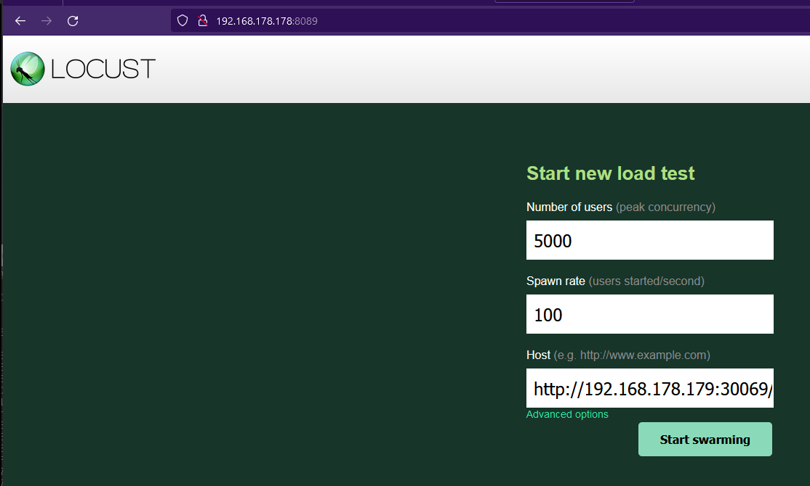
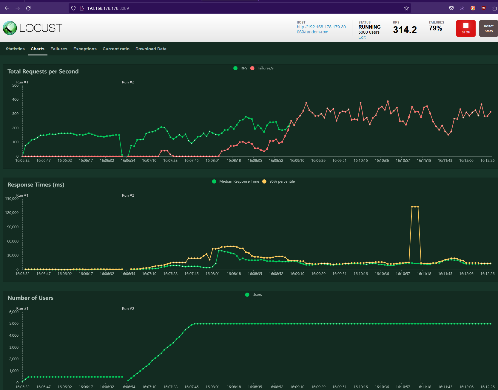
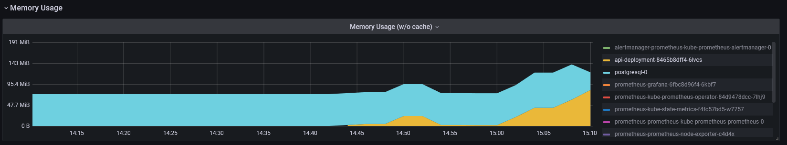
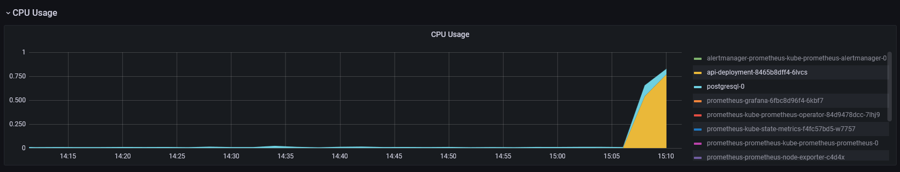

# Load Testing

In order to test your cluster you should have built a [Testing Environment](..\Testing-Environment\DescriptionOfTheEnvironment.md) with proper [Monitoring](..\Testing-Environment\Monitoring.md) 

## Locust:

- Have Locust [installed](Tools.md) 

Since Load and Stress Testing are both computationally intensive we will actually load the cluster from another device that can reach our API.

##### Here is a guide to create and run a simple load test

1. Create a Python script `locust.py`:

   ```python
   from locust import HttpUser, task, between
   
   class MyUser(HttpUser):
       wait_time = between(1, 5)
   
       @task
       def get_endpoint(self):
           self.client.get("http://192.168.178.178:30069/random-row")
   ```

   

2. Run the file:

   ```
   locust -f locust.py --host=http://192.168.178.178:30069/random-row
   ```


3.  Open Port 8089, you should see following UI:

    


4. Pick the wanted number of users a spawn rate (spawn rate should not be greater than 100)

   - There should be table were all the tasks are listed

5. Click on the graphical view

   

   - The  [Metrics](..\Research\Metrics.md) should be self explaining, in this case we can see the API Responsiveness of our Application.

6. Check your monitoring components to see how your other metrics are behaving

   

   

