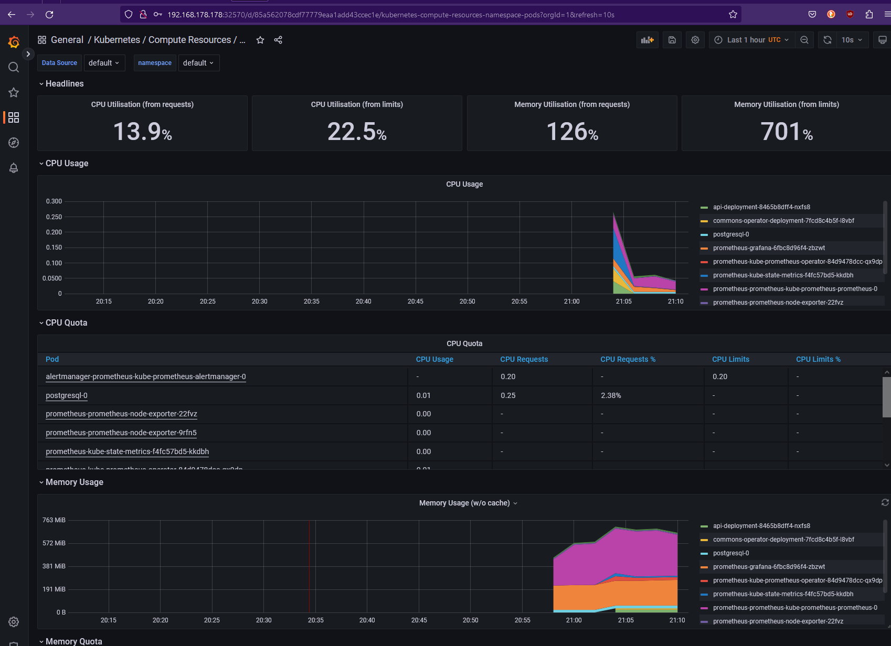

# Monitoring

Here is shown how we monitor the Kubernetes metrics of our cluster using **Prometheus** and **Grafana**

### Deploying Prometheus and Grafana:

For me the easiest way to deploy the monitoring components was to use Stackables command line tool


#### Installing Stackablectl:

Just follow this installation guide: https://docs.stackable.tech/stackablectl/stable/installation.html


#### Adding ServiceMonitor:

```yaml
apiVersion: monitoring.coreos.com/v1
kind: ServiceMonitor
metadata:
  name: scrape-label
  labels:
    release: prometheus
spec:
  endpoints:
  - port: metrics
  jobLabel: app.kubernetes.io/instance
  selector:
    matchLabels:
      prometheus.io/scrape: "true"
```

```bash
kubectl apply -f <FileName>
```


#### Deploying our monitoring components:

```bash
stackablectl stack install monitoring
```


=> Grafana and Prometheus should be reachable by their respective ports:

##### Prometheus:


##### Grafana:

- Username: admin
- Password: adminadmin


- If you click on the four squares on the left, you can press on `Browse>General>Kubernetes/Compute Ressources/Namespace(Pods)` you should be able to see something like this:

​	