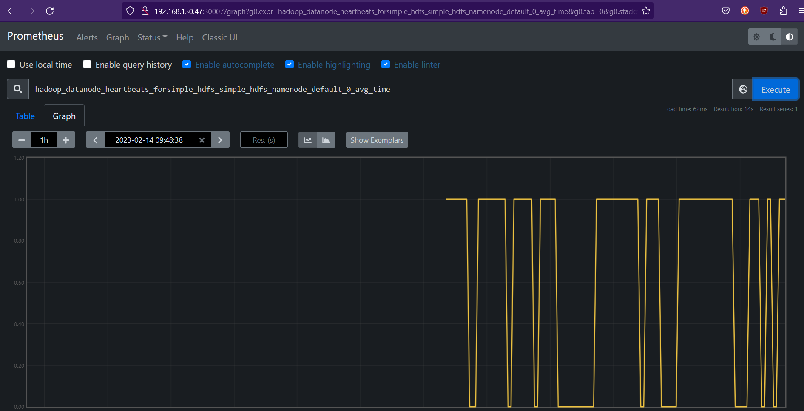

# Monitoring

Here it is shown how we monitor the Kubernetes metrics of our cluster using **Prometheus** and **Grafana**

### Deploying Prometheus and Grafana:

#### Adding and installing needed Helm-Charts

```bash
helm repo add prometheus-community https://prometheus-community.github.io/helm-charts
helm upgrade prometheus prometheus-community/kube-prometheus-stack --install --version 31.0.0
```


#### Adding ServiceMonitor:S

```yaml
apiVersion: monitoring.coreos.com/v1
kind: ServiceMonitor
metadata:
  name: scrape-label
  labels:
    release: prometheus
spec:
  endpoints:
  - port: metrics
  jobLabel: app.kubernetes.io/instance
  selector:
    matchLabels:
      prometheus.io/scrape: "true"
```

```bash
kubectl apply -f <FileName>
```


#### Accessing the UI of Prometheus and Grafana:

List all services:

```bash
kubectl get svc --all-namespaces
```

- Service `prometheus-kube-prometheus-prometheus` and service `prometheus-grafana` should be listed aswell


##### **Do the following for both services:**

- Output Configuration file:

  ```bash
  kubectl get svc <ServiceName> -o yaml
  ```

  =>  Possible Output:

  - ```bash
    root@ubuntu-mse-kubernetes-0001:/home/ubuntu# kubectl get svc prometheus-grafana -o yaml
    apiVersion: v1
    kind: Service
    metadata:
      annotations:
        meta.helm.sh/release-name: prometheus
        meta.helm.sh/release-namespace: default
      creationTimestamp: "2023-02-14T09:19:36Z"
      labels:
        app.kubernetes.io/instance: prometheus
        app.kubernetes.io/managed-by: Helm
        app.kubernetes.io/name: grafana
        app.kubernetes.io/version: 8.3.4
        helm.sh/chart: grafana-6.21.0
      name: prometheus-grafana
      namespace: default
      resourceVersion: "411417"
      uid: 989b28ff-8901-4105-9b4c-679274d5e237
    spec:
      clusterIP: 10.43.150.135
      clusterIPs:
      - 10.43.150.135
      internalTrafficPolicy: Cluster
      ipFamilies:
      - IPv4
      ipFamilyPolicy: SingleStack
      ports:
      - name: http-web
        port: 80
        protocol: TCP
        targetPort: 3000
      selector:
        app.kubernetes.io/instance: prometheus
        app.kubernetes.io/name: grafana
      sessionAffinity: None
      type: ClusterIP
    status:
      loadBalancer: {}
    ```


- **Change Configuration-Files:**

  - Remove following parts and their `childs`:
    - `status`
    - `uid`
    - `ressourceVersion`
    - `clusterIP`
    - `clusterIPs`
    - `internalTrafficPolicy`
    - `ipFamilies`
    - `ipFamilyPolicy`
    - `annotations`
    - `creationTimestamp`
    - `labels`
  - Change value of `spec/type` to `NodePort`

  - Add `spec/ports/nodePort` -> Set value to a free port.


**Files should look something like that:**

- prometheus-kube-prometheus-prometheus

  ```yaml
  apiVersion: v1
  kind: Service
  metadata:
    name: prometheus-kube-prometheus-prometheus
    namespace: default
  spec:
    ports:
    - name: http-web
      port: 9090
      protocol: TCP
      targetPort: 9090
      nodePort: 30007
    selector:
      app.kubernetes.io/name: prometheus
      prometheus: prometheus-kube-prometheus-prometheus
    type: NodePort
  ```

  

- prometheus-grafana

  ```yaml
  apiVersion: v1
  kind: Service
  metadata:
    name: prometheus-grafana
    namespace: default
  spec:
    ports:
    - name: http-web
      port: 80
      protocol: TCP
      targetPort: 3000
      nodePort: 30008
    selector:
      app.kubernetes.io/instance: prometheus
      app.kubernetes.io/name: grafana
    type: NodePort
  ```


Apply both files with `kubectl apply -f <FileName>`.


=> Grafana and Prometheus should be reachable by their respective ports:

##### Prometheus:




##### Grafana:

